# Busqueda por parte de los trabajadores para el tratamiento de salud mental

## Proposito del proyecto
Este modelo tiene como proposito detectar si un empleado buscara o no tratamiento de salud mental
## Datos usados
Se uso una encuesta de OSMI (Open Sourcing Mental Illness) (en español, "Abriendo el código de la salud mental"). Es una organización sin fines de lucro creada en Estados Unidos por la comunidad tecnológica, quienes buscan cambiar la forma en que se habla sobre la salud mental en el sector de la tecnología.

Proyecto final | Belen Mejia Medina | Adquisicion, analisis y procesamiento de datos

## Hipotesis

| Hipotesis | Variable dependiente | Variable independiente | Analisis inicial |
|------------|------------------------|------------|---------|
| H0: El apoyo laboral hacia los trabajadores no influencia en que busquen tratamiento de salud mental | Busqueda de tratamiento para su salud mental | Indice de apoyo institucional | Tabla de correlacion
| H1: A mayor apoyo laboral, mayores son las posibilidades de que los trabajadores busquen tratamiento para su salud mental | Busqueda de tratamiento mental | Indice de apoyo institucional | Tabla de correlacion
## Resultados de las pruebas aplicadas para la hipotesis
### t-student
Se uso la prueba de t-student de muestras independientes para saber si existe una diferencia significativa entre las medias de los grupos de personas que buscaron o no tratamiento.

El p-value se lo uso para saber cual hipotesis no rechazar

t-student resultado: 2.22

p-value resultado: 0.02

t-student indica que el promedio (la tasa de búsqueda de tratamiento) en el grupo de alto apoyo es significativamente mayor que en el grupo de bajo apoyo.

p-value indica que no existen pruebas suficientes para validar la hipotesis nula
### chi cuadrado
Se uso esta prueba para saber que tan alejados de la realidad estan nuestros resultados.

chi cuadrado resultado: 23.84

p-value resultado: 0.01

chi cuadrado indica que las varibles estan altamente relacionadas.

p-value indica que no existen pruebas suficientes para validar la hipotesis nula
## Modelos
## 1. Regresion logistica
**Analisis del desempeño del modelo**

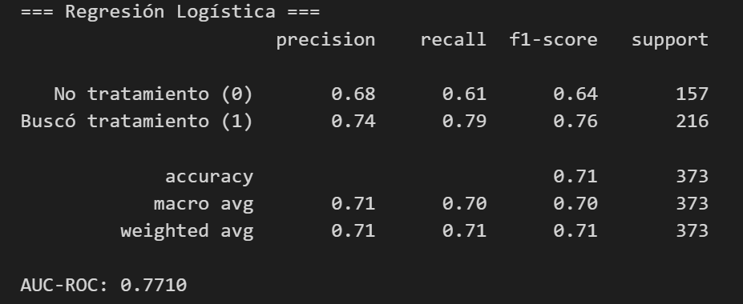

*precision*: Indica el porcentaje de aciertos del modelo, en este caso en los trabajadores que si buscaron tratamiento el modelo acerto en el 74% de los casos, generando un 26% de falsos positivos

*recall*: Indica a cuantos casos logro ver o predecir el modelo, en el caso de los trabajadores que si buscaron tratamiento el modelo logro predecir el 79% de los casos, generando 21% de falsos negativos.

*f1-score*: Es un promedio entre precision y recall

*support*: Indica la cantidad de trabajadores en cada grupo

*accuracy*: Indica el porcentaje de aciertos del modelo

*macro avg*: Es el promedio de precision y recall sin tomar en cuenta la cantidad de empleados en cada grupo

*weighted avg*: Es el promeedio de precision y recall pero tomando mas en cuenta al grupo con mas empleados

*AUC-ROC*: Es el area bajo la curva, es decir, indica la capacidad del modelo de predecir y dar la prioridad correcta a cada caso

**Validacion cruzada**

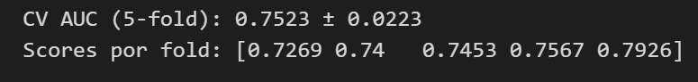

*CV AUC*: Indica el promedio de las notas del modelo en los 5 examenes, con una desviacion estandar de 0.0223

*Scores por fold*: Muestra las notas en cada examen del modelo

**Matriz de confusion**

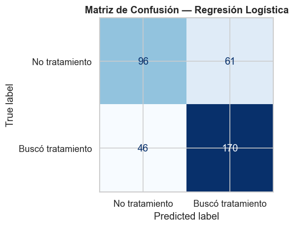

La diagonal principal indica los aciertos del modelo, en este caso acerto en 266 casos de los 373 casos del grupo de test

Los falsos negativos son 46 sobre 373

Falsos positivos son 61 sobre 373

## 2. Random forest
**Analisis del desempeño del modelo**

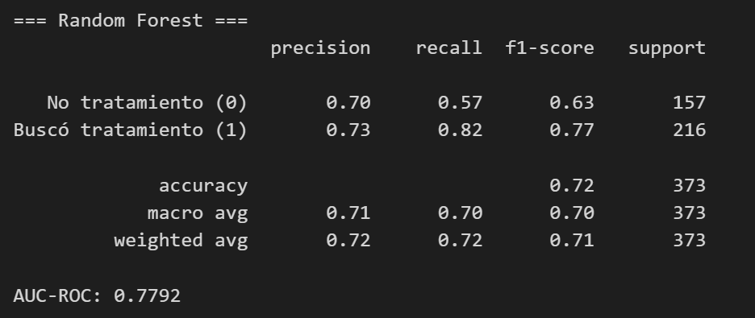

*precision*: Indica el porcentaje de aciertos del modelo en el caso de los trabajadores que si buscaron tratamientos acerto en el 73% de los casos, generando 27% de falsos positivos

*recall*: Indica a cuantos casos logro ver o predecir el modelo, en el caso de los trabajadores que si buscaron tratamiento logro detectar al 82% de los trabajadores, generando un 18% de falsos negativos

*f1-score*: Es un promedio entre precision y recall

*support*: Indica la cantidad de trabajadore en cada caso

*accuracy*: Indica el porcentaje de exito del modelo, es decirr en cuantos casos acerto y en cuantos no

*macro avg*: Es el promedio de precision y recall sin tomar en cuenta la cantidad de empleados en cada grupo

*weighted avg*: Es el promeedio de precision y recall pero tomando mas en cuenta al grupo con mas empleados

*AUC-ROC*: Es el area bajo la curva, es decir, indica la capacidad del modelo de predecir y dar la prioridad correcta a cada caso

**Validacion cruzada**

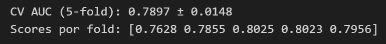

*CV AUC*: Indica el porcentaje de las notas del modelo en los 5 examenes realizados, con una desviacion estandar de 0.0148

*Scores por fold*: Muestra las notas de cada examen

**Matriz de confusion**

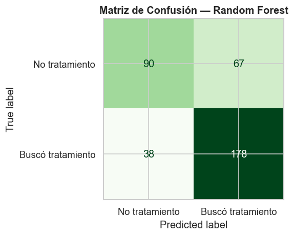

La diagonal principal indica los aciertos del modelo mostrando un total de 268 sobre 373 casos

Falsos negativos son 38 casos sobre 373

Falsos positivos son 67 casos sobre 373

**Top features**

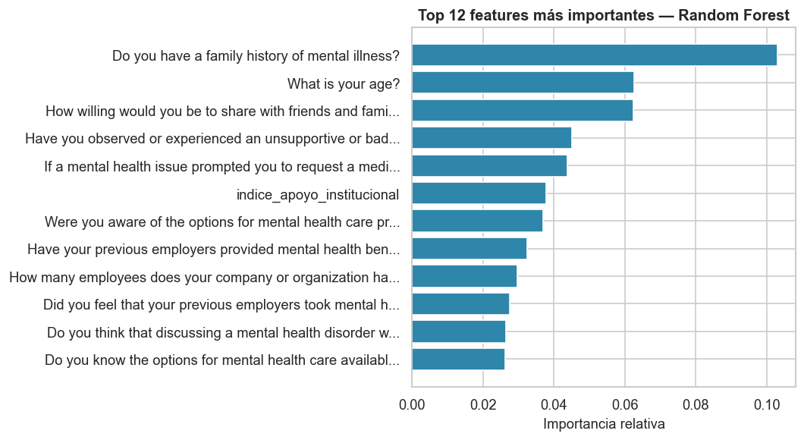

## 3. K-Nearest Neighbors (KNN)
**Analisis del desempeño del modelo**

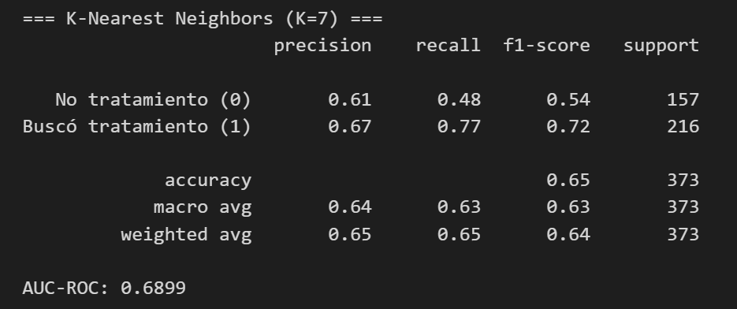

*precision*: Indica el exito del modelo en cada caso, por ejemplo en el caso de los trabajadores que si buscaron tratamiento acerto en el 67% de los casos, generando un 33% de falsos positivos

*recall*: Indica el porcentaje de trabajadores que el modelo logro ver o predecir, en el caso se los trabajadore que buscaron tratamiento el modelo logro ver a 77% de los trabajadores

*f1-score*: Indica el promedio de precision y recall

*support*: Indica la cantidad de trabajadores por caso

*accuracy*: Indica el porcentaje de exito que tuvo el modelo

*macro avg*: Es el porcentaje de precision y recall sin tomar en cuenta la cantidad de empleados por caso

*weighted avg*: Es el porcentaje de precision y recall tomando en cuenta la cantidad de empleados por caso

*AUC-ROC*: Es el area bajo la curva, indica que tan bueno es el modelo para dar prioridad a cada caso

**Validacion cruzada**

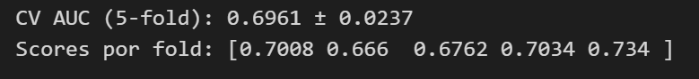

*CV AUC*: Indica el promedio de de las notas de los 5 examenes del modelo, con una desviacion estandar de 0.0237

*Scores por fold*: Muestra las notas de los 5 examenes realizadas por el modelo

**Matriz de confusion**
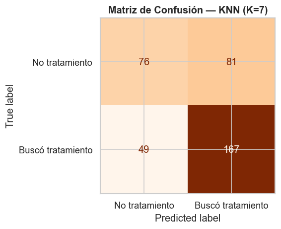

La diagonal principal indica los aciertos del modelo con un total de 243 sobre 373 casos

Los falsos negativos son 49 casos sobre 373

Los falsos positivos suman 81 sobre 373 casos

## Analisis comparativo de curvas ROC entre modelos
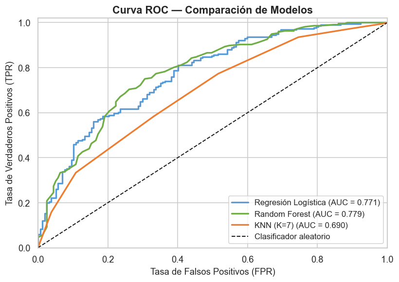

*Random forest*: Fue el mejor modelo ya que tiene el area bajo la curva mas grande

*Regresion logistica*: Segundo mejor modelo 

*KNN*: Tercer mejor modelo estando por debajo de lo bueno o aceptable

## Tabla comparativa del desempeño de los modelos
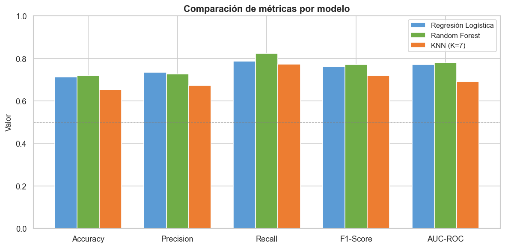

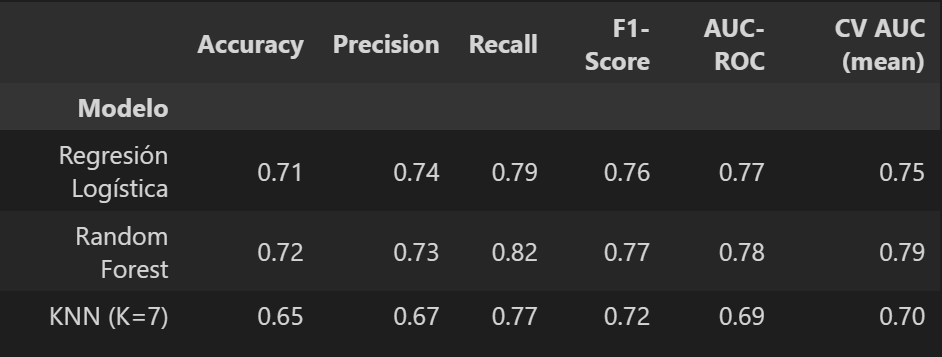

*Accuracy*: Se ve que no hay una diferencia muy significativa entre los dos primeros modelos pero si con el tercero

*Precision*: Igualmente la diferencia entre los dos primeros no es mucha pero si hay una notable diferencia con el tercero

*Recall*: Aqui ya se una diferencia mas variada entre los 3 modelos

*AUC-ROC*: Las curvas entre los dos primeros son casi iguales pero con el tercera hay una diferencia significativa

*CV AUC*: Es el promedio de las notas de los 5 examenes, y los valores son bastante diferentes entre los 3 modelos

## Conclusiones

| Modelo | Fortaleza | Debilidad |
|---|---|---|
| Regresion Logistica | Interpretable, robusto, AUC competitivo | Asume relaciones lineales |
| Random Forest | Mayor accuracy y AUC, importancia de features | Menos interpretable directamente |
| KNN | Simple conceptualmente | Sensible a dimensionalidad, AUC menor |

**Modelo recomendado: Random Forest**, Con AUC-ROC ~0.76 y el mejor balance de metricas. La variable mas importante es el historial familiar de enfermedades mentales, seguida de la edad y la disposicion a hablar con familia sobre salud mental